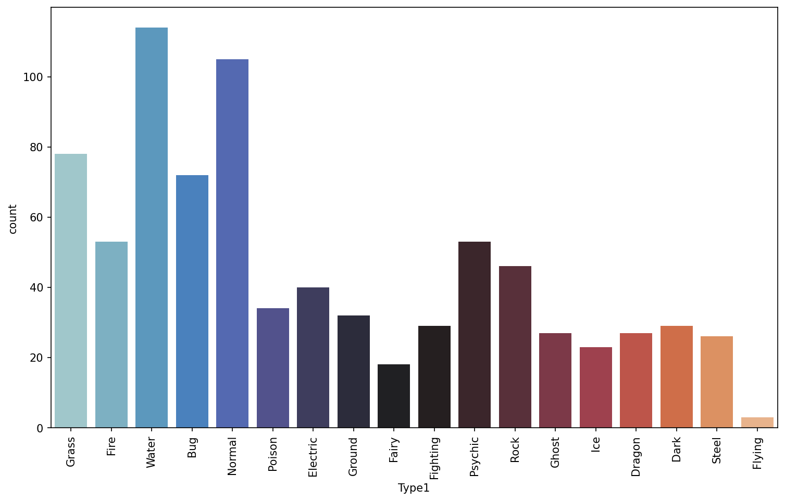
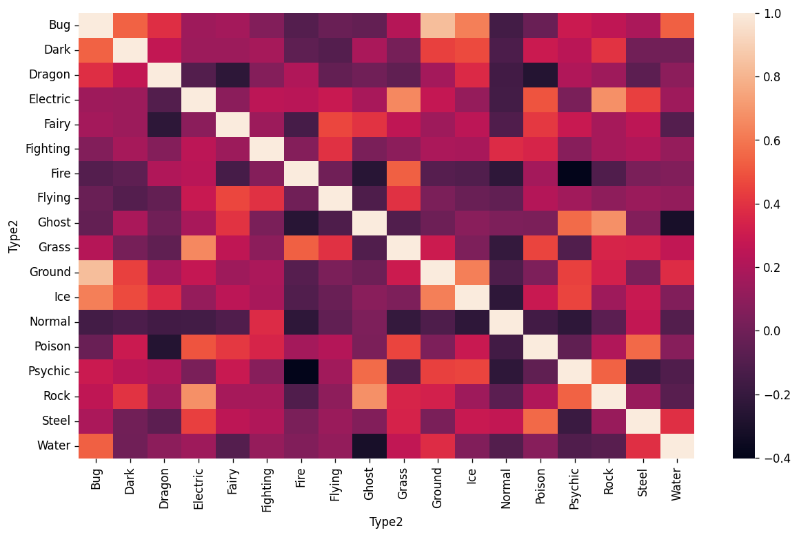
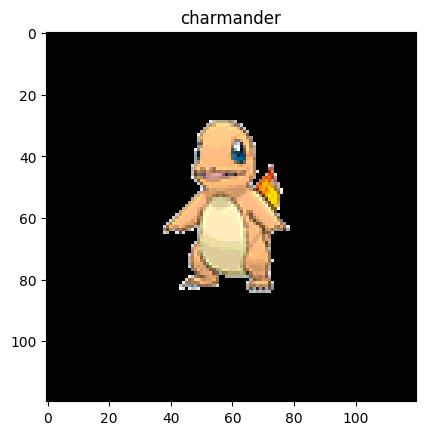
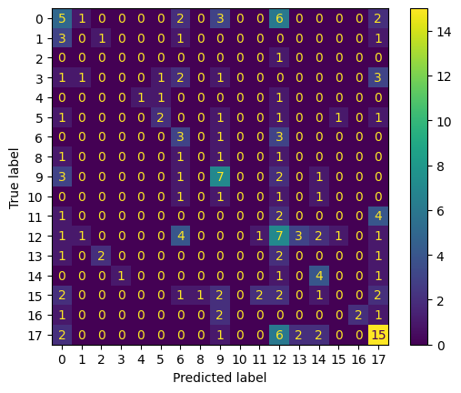
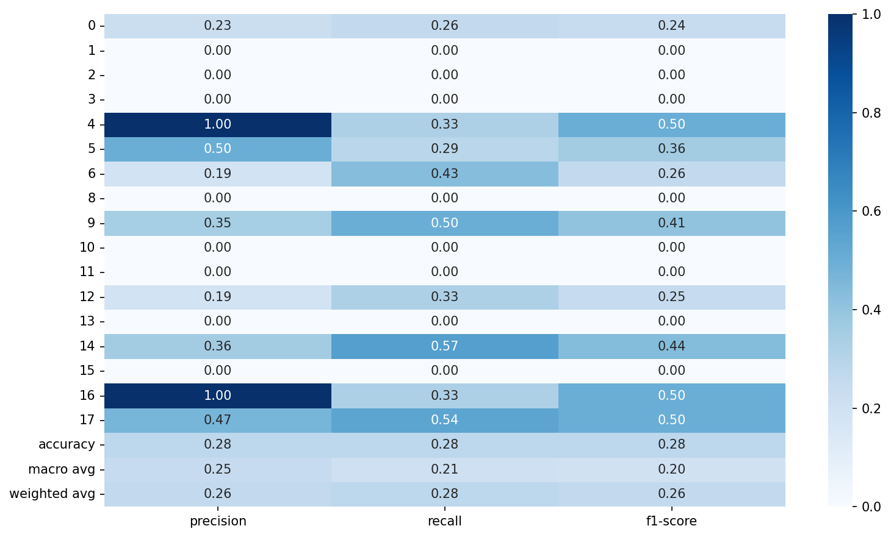
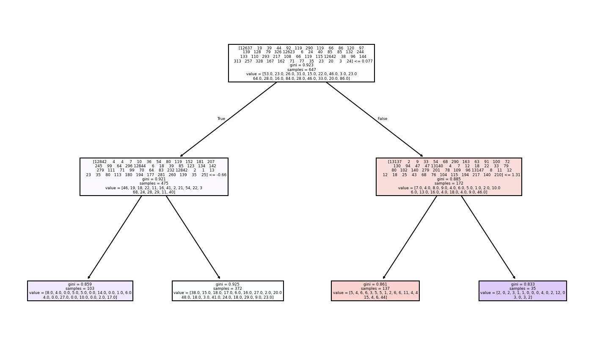
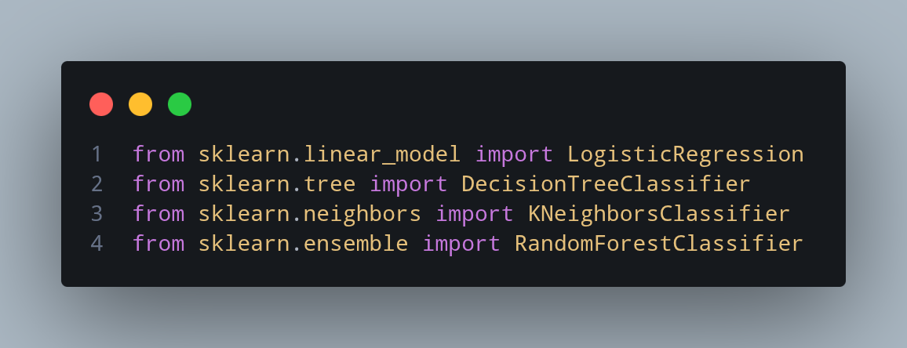
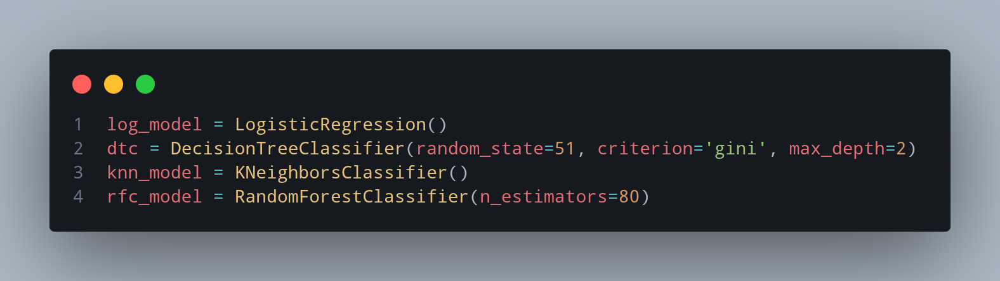

# Pokemon Type Predictor

In this project we train our model on pokemon images to predict their types.

## Lessons Learned

What did I learn while building this project? What challenges did I face and how did I overcome them?

### 1. No use of AI code
I didn't use any code by ai. I will admit that i did use ai but i was only to tell me how i am stuck at any point and why am i stuck.

### 2. Image to matrics
When I was learning ML i know we can convert images to metrics/np.array .
Now at that time i was only doing this to 1 image but during this project i had to make a loop and turn all the images in metrics.

### 3. Choosing Models
I did end-up with RandomForestClassifier 'rfc' because it was the most accurate in compression to other models i train.

Shown in images below.
## Run Locally

Clone the project

```bash
  git clone https://github.com/the-last-monarch/pokemon-type-prediction.git
```

Go to the project directory

```bash
  cd pokemon-type-prediction
```

Install dependencies

```bash
  pip install -r requirements.txt
```

Start the server

```bash
  streamlit run app.py
```


## How Model was trained

Insert gif or link to demo

### 1. Count-plot of Pokemon and their types


### 2. Heatmap of correlation between all the pokemons


### 3. Ploting image with matrics


### 4. Confussion Matrix of the trained model


### 5. Classifcation report of the trained model


### 6. Decision Tree map



### 7. Models i used




## Appendix

additional information

## 1. What's pending
Their is no pipeline yet, which can resize the image and take the image through everything in the model. 

The model can only be work better on pre-resized images without no background

## 2. Accuracy of the model
The model is still only 25% to 30% accurate according to accuracy_score but i will make a better model where i will remove the pokemon with numbers like 'Flying Type', 'Fairy Type' and etc. which has low number of pokemon and merge them in 1 type 'Other Types'.
i know its wrong but maybe the model will be more accurate.